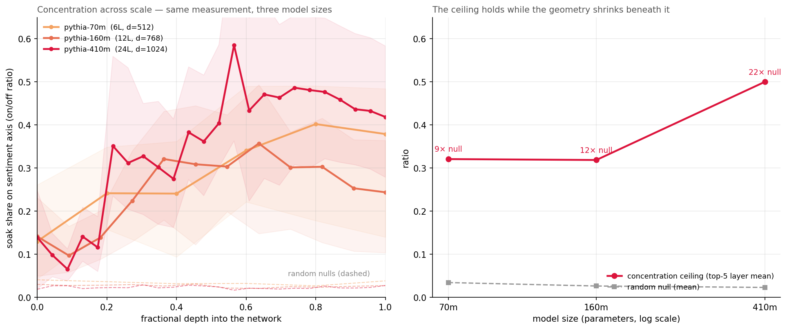
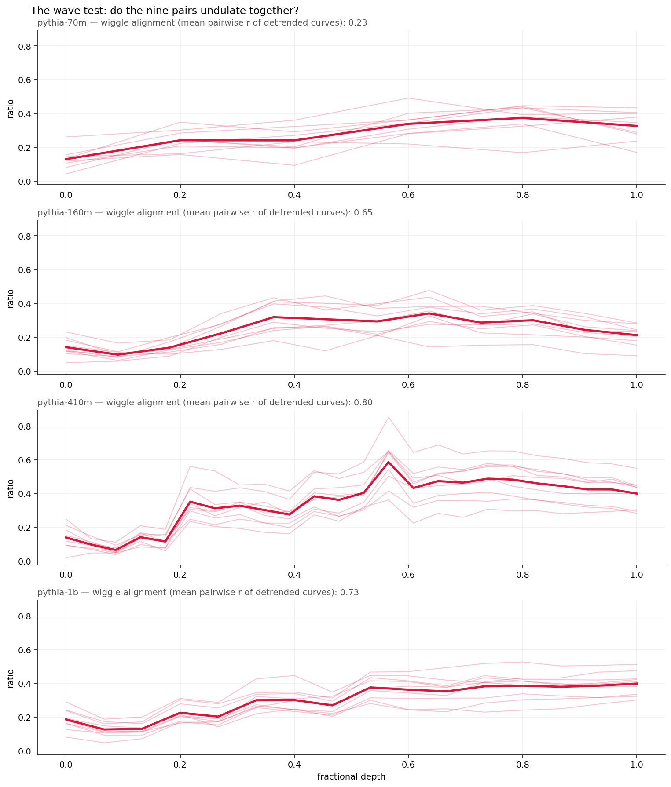

# activation-geometry-sentiment

How meaning moves through a transformer — found, traced, and tested across four model scales.

## What this adds up to

A transformer was never asked to represent anything. It was asked to predict, and representation is what prediction forced into existence. This project watched that happen at single-word resolution: flip one word, and the change does not stay where it landed — it soaks forward through words that never changed, compounds with depth, and concentrates onto a direction you can find with subtraction and validate with a random control.

Three regularities came out of the watching. Meaning assembles: consequence is not present at the embedding, it becomes legible over roughly two layers of attention, and the surprising branch assembles first. Concentration is defended: as models scale and one direction becomes a vanishing slice of the space, the network holds the same absolute share of the change on the feature direction anyway — concentration rises from ~9× to ~20× above chance while the geometry thins beneath it. And the holding has a rhythm: the depth profile is not a climb but a wave, and nine unrelated sentences place their crests and troughs at the same fractional depths. The rhythm belongs to the network. Every sentence dances to it.

None of this is yet a law. It is one feature, one model family, nine sentence pairs, and a set of instruments that killed two of my own predictions before confirming anything. But the instruments are simple enough to hand to anyone — difference of means, a projection, a random direction — and the pattern they reveal is the beginning of something a safety engineer could want: if drift toward a feature is visible before the feature-word arrives, and visible at the same depths regardless of the sentence, then the geometry of the residual stream is not just interpretable after the fact. It is monitorable in flight. That is the harness this repository is walking toward, one controlled cell at a time.

## Method

1. **Acquire.** Run Pythia-70m over small labelled sets of positive and negative sentences, capturing the residual stream at a middle layer (mean-pooled over tokens).
2. **Register.** Take the difference of the positive and negative means — this is the sentiment axis (a difference-of-means probe).
3. **Validate.** Project the training sentences onto the axis. Positives and negatives separate into two non-overlapping clusters. A **random control direction** does not separate them — confirming the signal is real structure, not an artifact of arbitrary projection.
4. **Trace.** Project each token of a fresh, sentiment-turning sentence onto the axis to read the signal as the model processes text.

## Results

The sentiment axis cleanly separates positive from negative sentences; the random control does not. In the token trace, the axis correctly elevates the positive word ("wonderful").

Honest limitations, kept in view rather than hidden:
- The signal on content tokens is **faint**, as expected for a 70m-parameter model.
- The largest deflections fall on the **first token** (an attention-sink / positional artifact) and the **final punctuation token**, not on the semantically negative word — a positional effect, not sentiment. Identifying and excluding these is part of the point.

Before excluding the first token, positional artifacts dominate the scale:

## Zooming in: token updates as rods

Each token's update to the residual stream (the difference between consecutive states) is decomposed against the sentiment axis: a signed component along it (back/forward), an off-axis magnitude, and a polar "rod" view drawn from a single reference point. Endpoint tokens are excluded as positional artifacts. The notebook includes an animated "needle" view of the same data — a rod deflecting per token: flat for neutral words, lifting for forward, dipping for back. (Animation runs in Colab; GitHub's preview shows a static frame.)

## Finding: the pivot carries the turn

The prediction was that "terrible" — the negative content word — would show the strongest backward tilt. It didn't. The strongest backward tilt falls on **"but"**: the model's state turns negative at the discourse pivot, before any negative word has arrived. The connective does the semantic work, and "terrible" lands in a state already turned.

In imaging terms: the contrast change appears at the boundary marker, not at the structure itself.

Against a random control axis, rods still tilt — but the tilts bear no relationship to word meaning, confirming the pattern is semantic rather than an artifact of projection.

Caveats, stated plainly: one sentence (n=1), one small model, one layer. Whether the pivot consistently out-tilts the content word is untested. This observation has earned a follow-up experiment, not a claim.

## Chapter 2: the soak — causal evidence that relational change compounds

A matched-pair control first *killed* an earlier finding: with vocabulary held constant, the apparent depth-growth of sentiment separation vanished — it had been substantially lexical. The honest successor was a causal, position-resolved probe: two sentences identical except one word ("wonderful"/"terrible").

Result: positions before the flip show exactly zero difference (causal hygiene). The flipped word carries a large change — trivially. But the five words *after* it — identical strings in both sentences — carry substantial flip-caused change, and that downstream "soak" **grows monotonically with depth** (0.69 at layer 0 to 7.25 at layer 5). One word's change spreads forward and compounds as the network processes.

Also in this chapter: a second validated feature axis (tense), found to live at the surface layers while sentiment develops deeper; the two axes are held nearly orthogonally (cosine −0.06). Surface features decay with depth; relational change compounds.

Caveats: n=1 sentence pair; the soak measures total downstream change, not sentiment-specific change; a dip at layer 3 is unexplained; one small model throughout.

## Chapter 3: decomposing the soak — what the shockwave is made of

Chapter 2 ended on a caveat: the soak measured total downstream change, not sentiment-specific change. This chapter opens that caveat. The instrument is the decomposition already built for the rods: split the flip-caused difference vector at each downstream position into a component along the sentiment axis and an off-axis remainder, with a random direction as the null.

**Result 1: the soak concentrates onto the sentiment axis with depth.** On the original pair, the on/off ratio climbs monotonically from 0.15 at layer 0 to 0.64 at layer 5, against a random-direction ratio of ~0.03–0.04 throughout. Widened to nine held-out matched pairs (axis built on a separate set; flip position auto-detected per pair), the population version is softer but holds: mean ratio rises from ~13% at layer 0 to ~40% by layers 3–5 — an order of magnitude above the null — then saturates rather than compounding indefinitely, with wide per-pair variance (0.14–0.48 at the top layers). The n=1 result was an unusually strong draw; n=9 is the honest number.

The open question that drove the rest: the flip changed sentiment and nothing else — yet ~60% of the resulting change never aligns with the sentiment direction. What is the remainder?

Hypothesis: the answer is in predictability law itself. The network was never trained to represent sentiment — it was trained to predict. The flip doesn’t just change a feature; it re-weights the probability of everything downstream. The 40% is the shadow that re-weighting casts on the one direction we have a filter for; the 60% may be the rest of the predictive adjustment — consequence, not noise.

**Result 2: the residue decodes coherently.** Projecting the sentiment component out and pushing the remainder through the unembedding, identical downstream tokens decode into opposite vocabularies: the wonderful-run lifts “joy”, “marvel”, “Excellent”, “delicious”, “Chef”; the terrible-run lifts “blame”, “accusations”, “retaliation”. The residue is structure, not noise — partly sentiment the single linear axis missed (the feature is spread across more than one direction), partly context-specific consequence. (A label inversion in the first run of this cell is preserved in the notebook with its correction.)

A prediction, locked and killed. I predicted consequence exists instantly — coherent at layer 0, merely smaller. It doesn’t. Layer 0 decodes to junk on both poles; the negative pole snaps into coherence at layer 2; both poles are legible by layer 4; the exit layer scrambles the weaker pole. Consequence is assembled over roughly two layers of attention — the assembly-distance hypothesis from Chapter 2 beating my own intuition. Two side-observations: negative valence coheres before positive, and the coherence trajectory (junk → partial → full → degraded) mirrors the concentration ratio’s climb and plateau — two independent instruments drawing the same curve.

**Result 3: the model anticipates before any valenced word arrives.** At the truncated prompt “…was absolutely”, the model’s expectations lean strongly positive: “wonderful” outranks “terrible” (rank 7 vs 67), “perfect” outranks “horrible” (5 vs 94), and the top prediction is “delicious” — the prior is scene-specific, not just valence-specific, even at 70m. This is a candidate mechanism for the assembly asymmetry: the flip to “terrible” violates the prior, and the surprising branch forces the larger, earlier update. Correction: the first version of this probe (preserved in the notebook) ran on the wrong sentence due to a variable-shadowing bug and probed the wrong position; it was caught when the Chapter 4 scaling setup re-ran the probe cleanly. Corrected numbers shown.

Caveats, stated plainly: n=9 pairs for the concentration result, n=1 for the decoding and prior probes; one small model; one axis-building recipe; a single random seed for the null (a proper null band is queued); decoded tokens read by eye; the layer-5 anomaly unexplained.

An earlier cross-model universality probe (Procrustes alignment, 70m vs 160m) was removed; it lacked null controls and is parked in the commit history until it can be done properly with CKA and cross-family comparison.

## Chapter 4: scale — the ceiling holds, the null shrinks, and a wave appears

The same measurement from Chapter 3, run across four model sizes: Pythia-70m, 160m, 410m, and 1B (6, 12, 24, and 16 layers; d_model 512 → 2048). Two predictions were locked before the runs; both were killed, and what survived is more interesting than either.

Prediction 1 (locked): the concentration ceiling is scale-invariant. Prediction 2 (locked, after the first three models): the 410m jump to ~0.50 marks a new plateau that 1B holds. Both wrong in instructive ways. The four ceilings (top-5 layer mean) read ~0.34, ~0.31, ~0.50, ~0.39: the absolute ceiling is roughly scale-stable at 0.3–0.4 — Prediction 1’s claim, resurrected at n=4 — with 410m as an outlier above the band, not a transition. The anomaly needing explanation is now that one model, not a trend.

The relative story strengthens monotonically. As models widen, one direction becomes a smaller slice of the space, and the random null duly falls (~0.03 at 70m to ~0.02 at 1B, tracking 1/√d). Against that shrinking baseline, concentration rises with scale — roughly 9× to ~20× above chance. The network holds the same absolute share of the shockwave on the feature direction while the geometry beneath it thins.

Finding: the wave. Reading the raw tables, the depth profile is not a smooth climb — it goes down, up, down, in undulations that appeared to widen with depth. Prediction, locked: the undulation is shared across sentence pairs, not an averaging artifact. Verdict: survived. Detrending each pair’s curve and correlating the wiggles: mean pairwise r = 0.65 (160m), 0.80 (410m), 0.73 (1B) — nine different sentences place their peaks and troughs at the same fractional depths. The rhythm belongs to the network; every sentence dances to it. In 70m (six layers) the score is 0.23 — too shallow for a wave to resolve. Interpretation, held loosely: alternating phases of concentration onto the feature direction and redistribution while other work is done — a breathing pattern in how the network holds meaning.

Caveats, stated plainly: n=9 pairs; one feature axis (sentiment) and one model family throughout; a single random seed per model (a 50-seed null band is queued); from_pretrained_no_processing used for memory, all four models identically treated (CPU fp32 vs GPU fp16 runs reproduced the small-model tables to the second decimal); the 410m anomaly and its layer-13 spike unexplained; the wave is described, not mechanistically explained. Queued next: the null band, the 410m check, and whether a second feature (tense) breathes at the same depths — if the wave is the network’s rhythm rather than sentiment’s, it should.

## Map of the experiments

| Chapter | Question | Method | What survived |
|---|---|---|---|
| **1 — The axis** | Is sentiment a linear direction in the residual stream? | Difference-of-means probe (Pythia-70m), random-direction control, per-token trace and "needle" decomposition | Clean separation vs. control. The strongest backward tilt lands on **"but"** — the pivot, not the negative word (n=1). |
| **2 — The soak** | Does relational change compound with depth? | Matched-pair control, then a causal position-resolved probe (one word flipped) | The control killed the lexical version. The causal soak grows monotonically with depth (0.69 → 7.25). Tense lives at the surface, near-orthogonal to sentiment. |
| **3 — Decomposition** | What is the soak made of? | Split flip-caused change into on-axis / off-axis; decode the residue through the unembedding; probe the pre-flip prior | Concentration climbs to ~40% by mid-depth (n=9, ~10× null). The residue decodes coherently — structure, not noise — and coherence is *assembled* over ~2 layers. |
| **4 — Scale** | Does the geometry hold across model size? | Same measurement, Pythia 70m → 160m → 410m → 1B | Absolute ceiling roughly scale-stable (~0.3–0.4) while the null shrinks: ~9× → ~20× above chance. Nine pairs share a depth-wave (r = 0.65–0.80). |

This reads one model, offline. The natural extension is a live **geometric harness**: monitoring a model's proximity to interpretable directions during generation and using that geometry as a control surface — flagging or gating on approach to safety-relevant regions of activation space. That's the larger idea this artifact is the first step toward. Chapters 3 and 4 strengthen the case: the soak concentrates onto readable directions — increasingly so relative to chance as models scale — meaning drift toward a feature is visible before the feature-word arrives.

## Run it
Open activation_space_demo.ipynb in Google Colab (free tier; CPU is sufficient for Pythia-70m). No API keys required. Chapter 3 lives in ch3-soak-decomposition.ipynb. Chapter 4 lives in ch4-scaling.ipynb (GPU runtime recommended for Pythia-1B).

