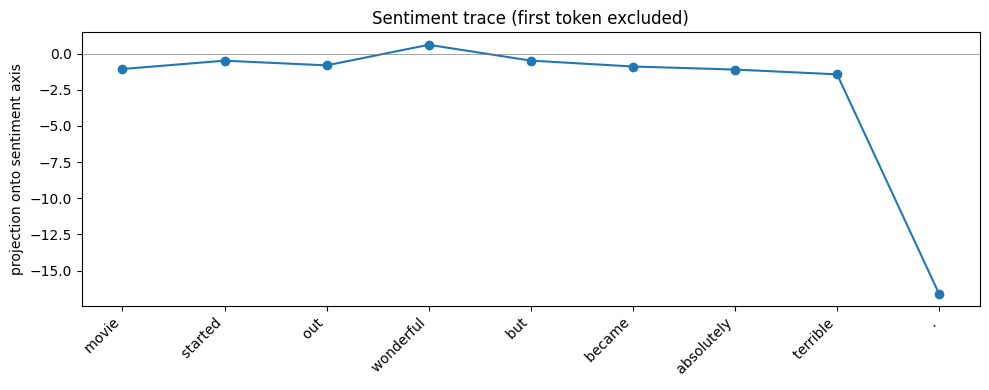
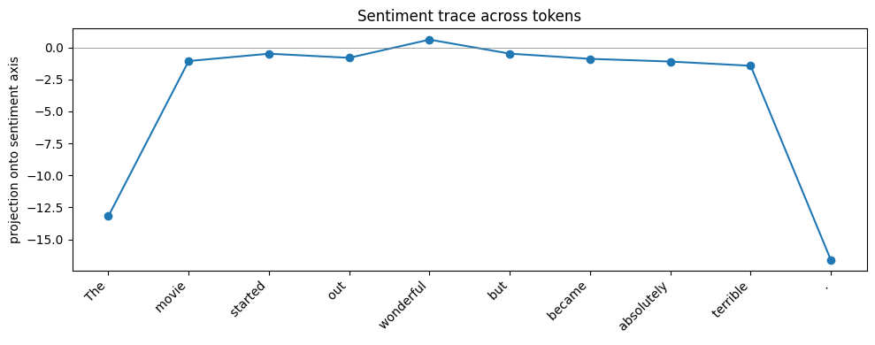
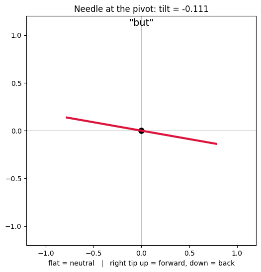
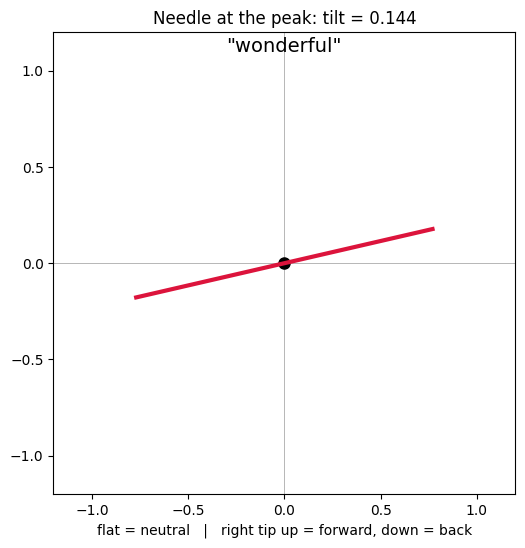
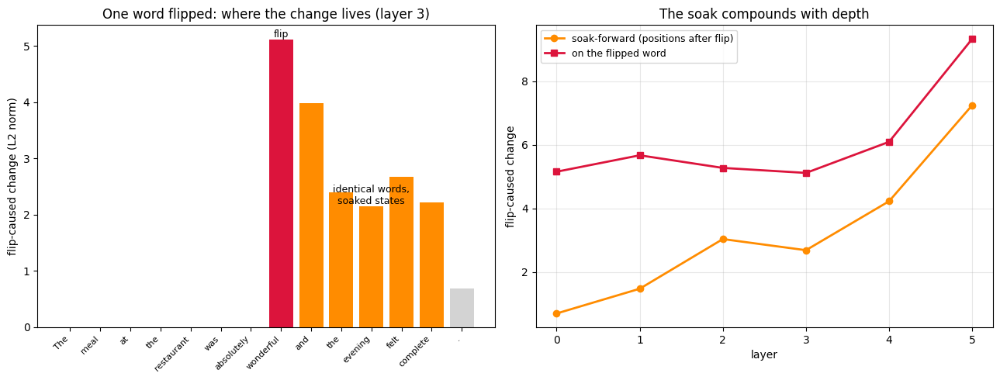
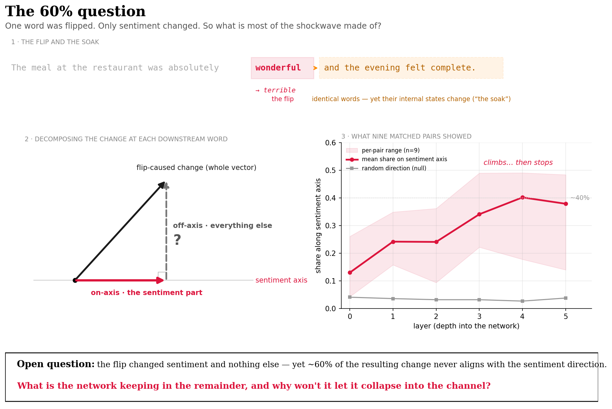

# activation-geometry-sentiment

Finding and validating a sentiment direction in a language model's activations — a mechanistic interpretability probe framed through medical imaging.

## What this is

A weekend probe of a small language model (Pythia-70m) that locates a single linear direction in the model's residual stream corresponding to sentiment, validates it against a control, and traces it token-by-token as the model reads text.

The framing is deliberate. I spent several years as an ophthalmic imaging specialist building computational pipelines (AOSLO, OCT) that make faint biological structure legible and quantifiable. Interpretability is the same problem on a different instrument: find the reference frame in which hidden structure becomes visible, then build the readout. This is the first cell of that idea.

## Method

1. **Acquire.** Run Pythia-70m over small labelled sets of positive and negative sentences, capturing the residual stream at a middle layer (mean-pooled over tokens).
2. **Register.** Take the difference of the positive and negative means — this is the sentiment axis (a difference-of-means probe).
3. **Validate.** Project the training sentences onto the axis. Positives and negatives separate into two non-overlapping clusters. A **random control direction** does not separate them — confirming the signal is real structure, not an artifact of arbitrary projection.
4. **Trace.** Project each token of a fresh, sentiment-turning sentence onto the axis to read the signal as the model processes text.

## Results

The sentiment axis cleanly separates positive from negative sentences; the random control does not. In the token trace, the axis correctly elevates the positive word ("wonderful").

Honest limitations, kept in view rather than hidden:
- The signal on content tokens is **faint**, as expected for a 70m-parameter model.
- The largest deflections fall on the **first token** (an attention-sink / positional artifact) and the **final punctuation token**, not on the semantically negative word — a positional effect, not sentiment. Identifying and excluding these is part of the point.

Before excluding the first token, positional artifacts dominate the scale:

## Zooming in: token updates as rods

Each token's update to the residual stream (the difference between consecutive states) is decomposed against the sentiment axis: a signed component along it (back/forward), an off-axis magnitude, and a polar "rod" view drawn from a single reference point. Endpoint tokens are excluded as positional artifacts. The notebook includes an animated "needle" view of the same data — a rod deflecting per token: flat for neutral words, lifting for forward, dipping for back. (Animation runs in Colab; GitHub's preview shows a static frame.)

## Finding: the pivot carries the turn

The prediction was that "terrible" — the negative content word — would show the strongest backward tilt. It didn't. The strongest backward tilt falls on **"but"**: the model's state turns negative at the discourse pivot, before any negative word has arrived. The connective does the semantic work, and "terrible" lands in a state already turned.

In imaging terms: the contrast change appears at the boundary marker, not at the structure itself.

Against a random control axis, rods still tilt — but the tilts bear no relationship to word meaning, confirming the pattern is semantic rather than an artifact of projection.

Caveats, stated plainly: one sentence (n=1), one small model, one layer. Whether the pivot consistently out-tilts the content word is untested. This observation has earned a follow-up experiment, not a claim.

## Chapter 2: the soak — causal evidence that relational change compounds

A matched-pair control first *killed* an earlier finding: with vocabulary held constant, the apparent depth-growth of sentiment separation vanished — it had been substantially lexical. The honest successor was a causal, position-resolved probe: two sentences identical except one word ("wonderful"/"terrible").

Result: positions before the flip show exactly zero difference (causal hygiene). The flipped word carries a large change — trivially. But the five words *after* it — identical strings in both sentences — carry substantial flip-caused change, and that downstream "soak" **grows monotonically with depth** (0.69 at layer 0 to 7.25 at layer 5). One word's change spreads forward and compounds as the network processes.

Also in this chapter: a second validated feature axis (tense), found to live at the surface layers while sentiment develops deeper; the two axes are held nearly orthogonally (cosine −0.06). Surface features decay with depth; relational change compounds.

Caveats: n=1 sentence pair; the soak measures total downstream change, not sentiment-specific change; a dip at layer 3 is unexplained; one small model throughout.

Chapter 3: decomposing the soak — what the shockwave is made of

Chapter 2 ended on a caveat: the soak measured total downstream change, not sentiment-specific change. This chapter opens that caveat. The instrument is the decomposition already built for the rods: split the flip-caused difference vector at each downstream position into a component along the sentiment axis and an off-axis remainder, with a random direction as the null.

Result 1: the soak concentrates onto the sentiment axis with depth. On the original pair, the on/off ratio climbs monotonically from 0.15 at layer 0 to 0.64 at layer 5, against a random-direction ratio of ~0.03–0.04 throughout. Widened to nine held-out matched pairs (axis built on a separate set; flip position auto-detected per pair), the population version is softer but holds: mean ratio rises from ~13% at layer 0 to ~40% by layers 3–5 — an order of magnitude above the null — then saturates rather than compounding indefinitely, with wide per-pair variance (0.14–0.48 at the top layers). The n=1 result was an unusually strong draw; n=9 is the honest number.

The open question that drove the rest: the flip changed sentiment and nothing else — yet ~60% of the resulting change never aligns with the sentiment direction. What is the remainder?

Hypothesis: the answer is in predictability law itself. The network was never trained to represent sentiment — it was trained to predict. The flip doesn’t just change a feature; it re-weights the probability of everything downstream. The 40% is the shadow that re-weighting casts on the one direction we have a filter for; the 60% may be the rest of the predictive adjustment — consequence, not noise.

Result 2: the residue decodes coherently. Projecting the sentiment component out and pushing the remainder through the unembedding, identical downstream tokens decode into opposite vocabularies: the wonderful-run lifts “joy”, “marvel”, “Excellent”, “delicious”, “Chef”; the terrible-run lifts “blame”, “accusations”, “retaliation”. The residue is structure, not noise — partly sentiment the single linear axis missed (the feature is spread across more than one direction), partly context-specific consequence. (A label inversion in the first run of this cell is preserved in the notebook with its correction.)

A prediction, locked and killed. I predicted consequence exists instantly — coherent at layer 0, merely smaller. It doesn’t. Layer 0 decodes to junk on both poles; the negative pole snaps into coherence at layer 2; both poles are legible by layer 4; the exit layer scrambles the weaker pole. Consequence is assembled over roughly two layers of attention — the assembly-distance hypothesis from Chapter 2 beating my own intuition. Two side-observations: negative valence coheres before positive, and the coherence trajectory (junk → partial → full → degraded) mirrors the concentration ratio’s climb and plateau — two independent instruments drawing the same curve.

Result 3: the model anticipates before any valenced word arrives. At the last shared token (” absolutely”), all fifteen top next-token predictions are positive or neutral; “wonderful” outranks “terrible” 123 to 693. A positivity prior from context alone — and a candidate mechanism for the assembly asymmetry: the flip to “terrible” violates the prior, and the surprising branch forces the larger, earlier update. The wrinkle: the expected words are lecture-vocabulary, not restaurant-vocabulary — at 70m parameters the prior carries the valence of the frame but not the semantics of the scene.

Caveats, stated plainly: n=9 pairs for the concentration result, n=1 for the decoding and prior probes; one small model; one axis-building recipe; a single random seed for the null (a proper null band is queued); decoded tokens read by eye; the layer-5 anomaly unexplained.

An earlier cross-model universality probe (Procrustes alignment, 70m vs 160m) was removed; it lacked null controls and is parked in the commit history until it can be done properly with CKA and cross-family comparison.

## Imaging parallel

| Imaging | This probe |
|---|---|
| Registering OCT slabs to a reference frame | Difference-of-means to find the sentiment axis |
| Contrast enhancement to reveal faint structure | Projection onto the axis |
| Distinguishing true structure from instrument artifact | Random-direction control; identifying positional artifacts |

## Future direction

This reads one model, offline. The natural extension is a live **geometric harness**: monitoring a model's proximity to interpretable directions during generation and using that geometry as a control surface — flagging or gating on approach to safety-relevant regions of activation space. That's the larger idea this artifact is the first step toward.Chapter 3 strengthens the case: the soak concentrates onto readable directions, meaning drift toward a feature is visible before the feature-word arrives

## Run it

Open `activation_space_demo.ipynb` in Google Colab (free tier; CPU is sufficient for Pythia-70m). No API keys required.

