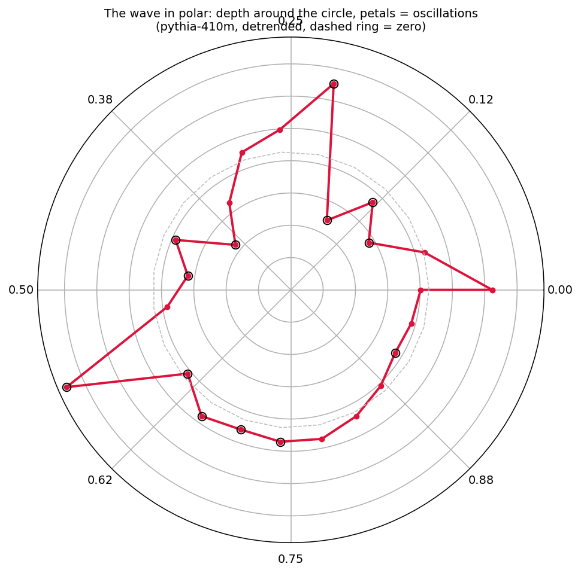
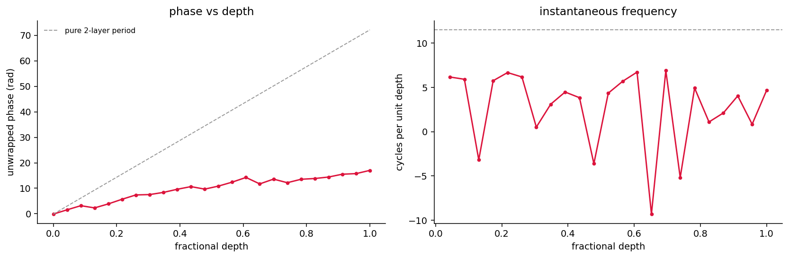
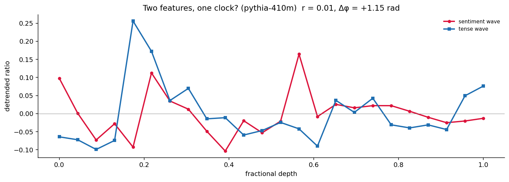
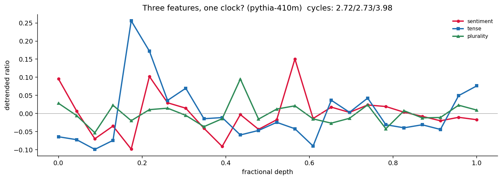
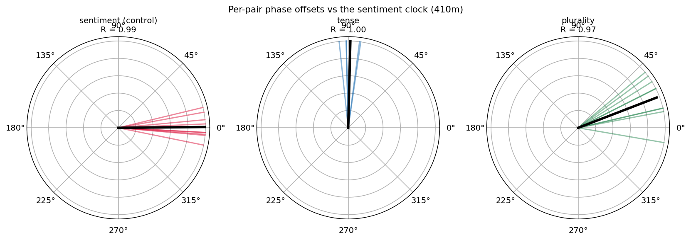
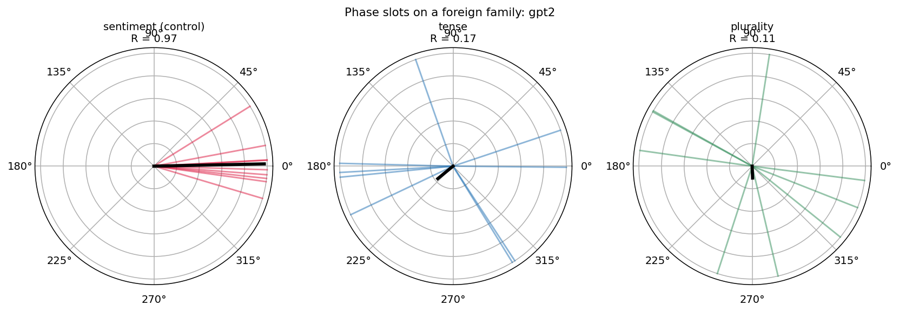

*If you use this work or the phaseprobe method, please cite this repository (Naomi James, 2026)*

# activation-geometry-sentiment

How meaning moves through a transformer — found, traced, and tested across six chapters and four model scales.

## What this adds up to

A transformer was never asked to represent anything. It was asked to predict, and representation is what prediction forced into existence. This project watched that happen at single-word resolution: flip one word, and the change does not stay where it landed — it soaks forward through words that never changed, compounds with depth, and concentrates onto a direction you can find with subtraction and validate with a random control.

Three regularities came out of the watching. Meaning assembles: consequence is not present at the embedding — it becomes legible over roughly two layers of attention, and the surprising branch assembles first. Concentration is defended: as models scale and one direction becomes a vanishing slice of the space, the network holds the same absolute share of the change on the feature direction anyway — concentration rises from ~9× to ~20× above chance while the geometry thins beneath it. And the holding keeps time: the depth profile is not a climb but a wave, nine unrelated sentences place their crests and troughs at the same fractional depths, and the wave completes the same ~2.7 cycles whether the network is 12, 16, or 24 layers deep. The rhythm belongs to the network. Every sentence dances to it. And the rhythm is shared but not synchronised: three features ride the same clock at three statistically distinct phase angles — sentiment at 0°, plurality at 21°, tense at 90°, each held pair-by-pair, the distinctness confirmed rather than assumed. The network doesn’t just breathe, it schedules — and each feature has its own address on the cycle.

None of this is yet a law. It is three features, one model family, nine sentence pairs, and a set of instruments that killed eight of my own locked predictions along the way — the kills preserved in the notebooks alongside the survivals, one kill overturned by a better instrument, and the final stake surviving its gate at p = 0.005, and the newest kill scoping the central equation on its first contact with a foreign model. But the instruments are simple enough to hand to anyone — difference of means, a projection, a random direction — and the pattern they reveal is the beginning of something a safety engineer could want: if drift toward a feature is visible before the feature-word arrives, visible at the same fractional depths regardless of the sentence, and each feature concentrates at its own fixed phase of one shared clock, then the geometry of the residual stream is not just interpretable after the fact. It is monitorable in flight — and the phase address may tell the harness which feature is moving from when it moves. That is what this repository is walking toward, one controlled cell at a time.

## Map of the experiments

| Chapter | Question | Method | What survived |
|---|---|---|---|
| **1 — The axis** | Is sentiment a linear direction in the residual stream? | Difference-of-means probe (Pythia-70m), random-direction control, per-token trace and "needle" decomposition | Clean separation vs. control. The strongest backward tilt lands on **"but"** — the pivot, not the negative word (n=1). |
| **2 — The soak** | Does relational change compound with depth? | Matched-pair control, then a causal position-resolved probe (one word flipped) | The control killed the lexical version. The causal soak grows monotonically with depth (0.69 → 7.25). Tense lives at the surface, near-orthogonal to sentiment. |
| **3 — Decomposition** | What is the soak made of? | Split flip-caused change into on-axis / off-axis; decode the residue through the unembedding; probe the pre-flip prior | Concentration climbs to ~40% by mid-depth (n=9, ~10× null). The residue decodes coherently — structure, not noise — and coherence is *assembled* over ~2 layers. |
| **4 — Scale** | Does the geometry hold across model size? | Same measurement, Pythia 70m → 160m → 410m → 1B | Absolute ceiling roughly scale-stable (~0.3–0.4) while the null shrinks: ~9× → ~20× above chance. Nine pairs share a depth-wave (r = 0.65–0.80). |
| **5 — The wave on trial** | Is the wave real — and whose is it? | Axis-split control; Hilbert phase; cross-scale period; second feature (tense) | Wave survives disjoint axes (0.96). Period is fractional: ~2.7 cycles at 12, 16, and 24 layers. Tense waves too (0.94) at the same period but uncorrelated phase (r = 0.01) — features share the clock, not the beat. |
| **6 — The phase slots** | Does a third feature share the clock — and where does it sit? | Plurality axis (ch2 sets), noun-only past-tense flip pairs; per-pair Hilbert phase with circular statistics and a self-control | Plurality waves (0.64, at threshold). Per-pair phase offsets cluster hard: sentiment 0° (control, R=0.99), plurality ~21° (R=0.97), tense ~89° — **quadrature** (R=1.00). Three features, three locked angles, one clock. ch5's r=0.01 resolved: orthogonality, not non-relation. Distinctness confirmed (permutation p = 0.005).
| **7 — The stranger** | Does the clock belong to Pythia or to transformers? | Phase-Slot Hypothesis stated as one equation; pipeline packaged (`phaseprobe`); same probe on GPT-2 small (12 layers, foreign family) | Wave replicates and strengthens (0.877 vs 0.80 benchmark). Period does not transfer: 1.60 vs ~2.7 cycles — **family-specific clock, universal clock-structure**. Slot structure gated (tense/plurality R = 0.17/0.11, below the locked gate); unresolved, not absent. Chapter open. |

## Method

**Acquire.** Run Pythia-70m over small labelled sets of positive and negative sentences, capturing the residual stream at a middle layer (mean-pooled over tokens).
2. **Register.** Take the difference of the positive and negative means — this is the sentiment axis (a difference-of-means probe).
3. **Validate.** Project the training sentences onto the axis. Positives and negatives separate into two non-overlapping clusters. A **random control direction** does not separate them — confirming the signal is real structure, not an artifact of arbitrary projection.
4. **Trace.** Project each token of a fresh, sentiment-turning sentence onto the axis to read the signal as the model processes text.

## Results

The sentiment axis cleanly separates positive from negative sentences; the random control does not. In the token trace, the axis correctly elevates the positive word ("wonderful").

Honest limitations, kept in view rather than hidden:
- The signal on content tokens is **faint**, as expected for a 70m-parameter model.
- The largest deflections fall on the **first token** (an attention-sink / positional artifact) and the **final punctuation token**, not on the semantically negative word — a positional effect, not sentiment. Identifying and excluding these is part of the point.

Before excluding the first token, positional artifacts dominate the scale:

## Zooming in: token updates as rods

Each token's update to the residual stream (the difference between consecutive states) is decomposed against the sentiment axis: a signed component along it (back/forward), an off-axis magnitude, and a polar "rod" view drawn from a single reference point. Endpoint tokens are excluded as positional artifacts. The notebook includes an animated "needle" view of the same data — a rod deflecting per token: flat for neutral words, lifting for forward, dipping for back. (Animation runs in Colab; GitHub's preview shows a static frame.)

## Finding: the pivot carries the turn

The prediction was that "terrible" — the negative content word — would show the strongest backward tilt. It didn't. The strongest backward tilt falls on **"but"**: the model's state turns negative at the discourse pivot, before any negative word has arrived. The connective does the semantic work, and "terrible" lands in a state already turned.

In imaging terms: the contrast change appears at the boundary marker, not at the structure itself.

Against a random control axis, rods still tilt — but the tilts bear no relationship to word meaning, confirming the pattern is semantic rather than an artifact of projection.

Caveats, stated plainly: one sentence (n=1), one small model, one layer. Whether the pivot consistently out-tilts the content word is untested. This observation has earned a follow-up experiment, not a claim.

## Chapter 2: the soak — causal evidence that relational change compounds

A matched-pair control first *killed* an earlier finding: with vocabulary held constant, the apparent depth-growth of sentiment separation vanished — it had been substantially lexical. The honest successor was a causal, position-resolved probe: two sentences identical except one word ("wonderful"/"terrible").

Result: positions before the flip show exactly zero difference (causal hygiene). The flipped word carries a large change — trivially. But the five words *after* it — identical strings in both sentences — carry substantial flip-caused change, and that downstream "soak" **grows monotonically with depth** (0.69 at layer 0 to 7.25 at layer 5). One word's change spreads forward and compounds as the network processes.

Also in this chapter: a second validated feature axis (tense), found to live at the surface layers while sentiment develops deeper; the two axes are held nearly orthogonally (cosine −0.06). Surface features decay with depth; relational change compounds.

Caveats: n=1 sentence pair; the soak measures total downstream change, not sentiment-specific change; a dip at layer 3 is unexplained; one small model throughout.

## Chapter 3: decomposing the soak — what the shockwave is made of

Chapter 2 ended on a caveat: the soak measured total downstream change, not sentiment-specific change. This chapter opens that caveat. The instrument is the decomposition already built for the rods: split the flip-caused difference vector at each downstream position into a component along the sentiment axis and an off-axis remainder, with a random direction as the null.

**Result 1: the soak concentrates onto the sentiment axis with depth.** On the original pair, the on/off ratio climbs monotonically from 0.15 at layer 0 to 0.64 at layer 5, against a random-direction ratio of ~0.03–0.04 throughout. Widened to nine held-out matched pairs (axis built on a separate set; flip position auto-detected per pair), the population version is softer but holds: mean ratio rises from ~13% at layer 0 to ~40% by layers 3–5 — an order of magnitude above the null — then saturates rather than compounding indefinitely, with wide per-pair variance (0.14–0.48 at the top layers). The n=1 result was an unusually strong draw; n=9 is the honest number.

The open question that drove the rest: the flip changed sentiment and nothing else — yet ~60% of the resulting change never aligns with the sentiment direction. What is the remainder?

Hypothesis: the answer is in predictability law itself. The network was never trained to represent sentiment — it was trained to predict. The flip doesn’t just change a feature; it re-weights the probability of everything downstream. The 40% is the shadow that re-weighting casts on the one direction we have a filter for; the 60% may be the rest of the predictive adjustment — consequence, not noise.

**Result 2: the residue decodes coherently.** Projecting the sentiment component out and pushing the remainder through the unembedding, identical downstream tokens decode into opposite vocabularies: the wonderful-run lifts “joy”, “marvel”, “Excellent”, “delicious”, “Chef”; the terrible-run lifts “blame”, “accusations”, “retaliation”. The residue is structure, not noise — partly sentiment the single linear axis missed (the feature is spread across more than one direction), partly context-specific consequence. (A label inversion in the first run of this cell is preserved in the notebook with its correction.)

A prediction, locked and killed. I predicted consequence exists instantly — coherent at layer 0, merely smaller. It doesn’t. Layer 0 decodes to junk on both poles; the negative pole snaps into coherence at layer 2; both poles are legible by layer 4; the exit layer scrambles the weaker pole. Consequence is assembled over roughly two layers of attention — the assembly-distance hypothesis from Chapter 2 beating my own intuition. Two side-observations: negative valence coheres before positive, and the coherence trajectory (junk → partial → full → degraded) mirrors the concentration ratio’s climb and plateau — two independent instruments drawing the same curve.

**Result 3: the model anticipates before any valenced word arrives.** At the truncated prompt “…was absolutely”, the model’s expectations lean strongly positive: “wonderful” outranks “terrible” (rank 7 vs 67), “perfect” outranks “horrible” (5 vs 94), and the top prediction is “delicious” — the prior is scene-specific, not just valence-specific, even at 70m. This is a candidate mechanism for the assembly asymmetry: the flip to “terrible” violates the prior, and the surprising branch forces the larger, earlier update. Correction: the first version of this probe (preserved in the notebook) ran on the wrong sentence due to a variable-shadowing bug and probed the wrong position; it was caught when the Chapter 4 scaling setup re-ran the probe cleanly. Corrected numbers shown.

Caveats, stated plainly: n=9 pairs for the concentration result, n=1 for the decoding and prior probes; one small model; one axis-building recipe; a single random seed for the null (a proper null band is queued); decoded tokens read by eye; the layer-5 anomaly unexplained.

An earlier cross-model universality probe (Procrustes alignment, 70m vs 160m) was removed; it lacked null controls and is parked in the commit history until it can be done properly with CKA and cross-family comparison.

## Chapter 4: scale — the ceiling holds, the null shrinks, and a wave appears

The same measurement from Chapter 3, run across four model sizes: Pythia-70m, 160m, 410m, and 1B (6, 12, 24, and 16 layers; d_model 512 → 2048). Two predictions were locked before the runs; both were killed, and what survived is more interesting than either.

Prediction 1 (locked): the concentration ceiling is scale-invariant. Prediction 2 (locked, after the first three models): the 410m jump to ~0.50 marks a new plateau that 1B holds. Both wrong in instructive ways. The four ceilings (top-5 layer mean) read ~0.34, ~0.31, ~0.50, ~0.39: the absolute ceiling is roughly scale-stable at 0.3–0.4 — Prediction 1’s claim, resurrected at n=4 — with 410m as an outlier above the band, not a transition. The anomaly needing explanation is now that one model, not a trend.

The relative story strengthens monotonically. As models widen, one direction becomes a smaller slice of the space, and the random null duly falls (~0.03 at 70m to ~0.02 at 1B, tracking 1/√d). Against that shrinking baseline, concentration rises with scale — roughly 9× to ~20× above chance. The network holds the same absolute share of the shockwave on the feature direction while the geometry beneath it thins.

Finding: the wave. Reading the raw tables, the depth profile is not a smooth climb — it goes down, up, down, in undulations that appeared to widen with depth. Prediction, locked: the undulation is shared across sentence pairs, not an averaging artifact. Verdict: survived. Detrending each pair’s curve and correlating the wiggles: mean pairwise r = 0.65 (160m), 0.80 (410m), 0.73 (1B) — nine different sentences place their peaks and troughs at the same fractional depths. The rhythm belongs to the network; every sentence dances to it. In 70m (six layers) the score is 0.23 — too shallow for a wave to resolve. Interpretation, held loosely: alternating phases of concentration onto the feature direction and redistribution while other work is done — a breathing pattern in how the network holds meaning.

Caveats, stated plainly: n=9 pairs; one feature axis (sentiment) and one model family throughout; a single random seed per model (a 50-seed null band is queued); from_pretrained_no_processing used for memory, all four models identically treated (CPU fp32 vs GPU fp16 runs reproduced the small-model tables to the second decimal); the 410m anomaly and its layer-13 spike unexplained; the wave is described, not mechanistically explained. Queued next: the null band, the 410m check, and whether a second feature (tense) breathes at the same depths — if the wave is the network’s rhythm rather than sentiment’s, it should.

## Chapter 5: the wave on trial — three kills, two survivals, and a schedule

Chapter 4 ended with a wave and a suspicion. All nine pairs shared the same per-layer axes, so a wobble in axis *quality* across layers would produce correlated wiggles mechanically — the wave's most dangerous rival explanation. Chapter 5 put it on trial.

**The axis-split control (survived).** Axes built from two disjoint sentence sets — per-layer cosine between them only 0.51–0.82, so genuinely different directions — produce the same wave: cross-set correlation of detrended mean curves 0.96, against within-set 0.78/0.86. The wave is not the instrument's. Side-finding: difference-of-means directions agree only ~0.5 at the surface and converge to ~0.7–0.8 deep — the feature direction itself sharpens with depth, and the axis-agreement peak (0.815) lands on layer 13, the ch4 anomaly layer.

**The chirp (locked, killed).** Prediction: the wave's wavelength stretches with depth. It doesn't — extrema spacing sits at the layer-sampling limit with two inversions, and the late-depth half is *higher*-frequency than the early half. What the corpse revealed: the extrema alternate at nearly every layer, punctuated by quiet stretches — not a stretching wave but a fast oscillation, gated.

**Layer parity (killed).** The fast alternation is not a mechanical even/odd zigzag: r = −0.17 against a pure period-2 reference. The wave locks step briefly, then slips phase.

**The spin (locked, survived).** A polar rendering of the wave appeared to rotate — translated into a claim: the phase drifts systematically against the layer grid. Hilbert phase analysis confirmed it, and reframed everything: mean period **8.43 layers**, a slow oscillation completing ~2.7 cycles across the network with fast ripple on top. This is what confused the earlier instruments.

**Fractional or absolute (locked: fractional; survived).** Is the period fixed in layers or in fractional depth? Pythia-160m (12 layers): 2.65 cycles, fractional period 0.38. Pythia-1B (16 layers): 2.71 cycles, 0.37. 410m (24 layers): ~2.7, 0.37. Three depths, one number — the network divides its processing into the same phases whatever the layer budget. The absolute-period hypothesis (predicting 1.4 and 1.9 cycles) is dead by a factor of two.

**The growth law (locked, killed).** The spiral rendering suggested a snail-like geometric envelope. Tested: log-amplitude vs phase, r² = 0.005, growth ×0.97/cycle — no law. What stands instead: the oscillation runs at roughly constant loudness where it runs at all, interrupted by quiet stretches. The envelope is gated, not growing.

**The tense test (locked: same rhythm, same phase; killed — and the kill is the finding).** A second feature axis (tense, ch2 recipe) run through the same causal probe on eight held-out pairs. The tense wave is real — within-pair alignment **0.937**, exceeding sentiment's 0.80 benchmark — and its period matches sentiment's (2.73 vs ~2.7 cycles). But the two waves are **uncorrelated** (r = 0.008): matched frequency, unmatched phase. Where sentiment redistributes, tense concentrates. Two features ride the same ~0.37-fractional clock at different moments — the network doesn't just breathe, it **schedules**.

Caveats, stated plainly: the two-feature comparison is one model (410m); two features; n=9/n=8 pairs; Hilbert phase on 12–24 samples is coarse; the phase offset is estimated from short signals; the scheduling claim needs a third feature and a cross-scale phase check; mechanism untested; layer 13 still unexplained — now flagged by three independent instruments (concentration spike, axis-agreement peak, wave amplitude maximum). This chapter also reconciles an apparent tension with ch2: tense's *separability* decays after the surface layers, but its concentration dynamics stay structured to full depth — the feature fades as a cluster while its share of the shockwave keeps oscillating.

## Chapter 6: the phase slots — three features, three angles, one clock

Chapter 5 ended with two features sharing a period but “uncorrelated” in phase (r = 0.008), and a claim — the network schedules — resting on a phase offset estimated from one short averaged signal. Chapter 6 brought a third feature and, when the first instrument failed, a better one.

The setup. A plurality axis built from the ch2 singular/plural sets, tested on nine new matched pairs designed to isolate number: past tense throughout (no verb agreement), a single noun token flipped, downstream clauses number-neutral. Three predictions locked: plurality waves (70%); same fractional period (80%); plurality phases with tense — grammatical features sharing a slot (60%).

First pass: one survival, one kill, one gate. The plurality wave is real but the weakest of the three (within-pair alignment 0.637, against a locked threshold of 0.6). Its Hilbert period read 3.98 cycles — apparently killing the shared-period prediction. And the phase comparison returned resultant lengths of 0.18–0.36 across all three feature pairings — below the pre-stated trust line, no verdict. Worse, the retroactive tense–sentiment row implied ch5’s offset might be a drift-average rather than a held slot.

Two instrument failures, preserved. An amplitude-masked retest collapsed: the features’ loud layers don’t coincide, leaving 1–6 of 24 layers under a joint mask — R computed on one layer is true by definition and means nothing. And a split-half test showed plurality’s 3.98-cycle period scattering from 2.8 to 6.3 across random halves — not a stable period but what Hilbert reports when fast noise rides a weak carrier. The period kill was downgraded to “not resolved.” Both failures pointed at the same repair: stop asking one averaged wave for its phase, and ask the pairs individually.

The per-pair instrument, and the finding. Each sentence pair’s individual wave was phase-compared to the sentiment reference clock, with circular statistics across pairs and a self-control: sentiment pairs against their own mean cluster at R = 0.99 — the instrument is real. Then: five testifying tense pairs report offsets between 1.44 and 1.68 rad — mean +1.55 rad = 0.49π, quadrature to two decimals (R = 1.00, Rayleigh p < 0.001). This resolves ch5’s r = 0.008 exactly: two same-period waves at 90° correlate at zero. “Uncorrelated” was orthogonality’s shadow all along. The scheduling claim returns sharper than ch5 stated it.

The locked prediction killed — and the kill is the finding, again. Plurality does not phase with tense. Nine pairs cluster at +0.37 rad ≈ 21° (R = 0.97) — nowhere near tense’s 89°, and distinct from sentiment’s 0°. Grammatical features do not share a slot. Three features hold three different, tightly-locked angles on one ~2.7-cycle clock: phase appears to encode feature identity, not feature class. A side-resolution falls out free: if plurality truly ran a 3.98-cycle clock, its offset against sentiment would drift and per-pair R would collapse; R = 0.97 says it shares the ~2.7 clock, confirming the split-half diagnosis — two instruments corroborating.

The distinctness gate, closed. The final queued test: is plurality’s 21° genuinely its own slot, or sentiment’s 0° measured noisily? Locked before running: permutation p < 0.05 → three distinct slots, at a stake of 70%. Verdict: separated — Watson–Williams F = 11.04, p = 0.0043; permutation test (10k shuffles) p = 0.0056. Three slots stand. A footnote earned by the day itself: the confirming run reproduced the previous day’s control (+0.5°, R = 0.99) and plurality (+20.7°, R = 0.96) values on a different VM through a different weights format — an accidental robustness check on top of the intended one.

Caveats, stated plainly: one model (410m); three of eight tense pairs abstained under the joint-loudness rule, so tense’s n = 5; all angles are measured against sentiment’s mean curve as the reference; plurality’s 21° is confirmed distinct from the control’s 0° by two-sample circular tests (Watson–Williams p = 0.0043; assumption-free permutation test, 10k shuffles, p = 0.0056); the plurality axis may carry verb-agreement flavour from the ch2 sets; the quadrature reading of r = 0.008 was an interpretive hunch preceding the ch6 data, not a locked prediction — the locked predictions this chapter graded were the three above; mechanism untested; cross-scale phase check queued.

Chapter 7: one clock, many models — the hypothesis meets a stranger

Six chapters, one model family. Every number so far could in principle be a fact about EleutherAI’s training recipe rather than about transformers. Chapter 7 compressed the findings into a single falsifiable statement and handed the instrument to a foreign model.

The Phase-Slot Hypothesis. For feature f, the detrended concentration wave at fractional depth t is

**w_f(t) = A_f(t) · cos(2πν·t + φ_f)**

with three constraints carrying the content: ν belongs to the network, not the feature (one frequency for all features, constant in fractional depth across layer budgets — ν ≈ 2.7 in Pythia); φ_f belongs to the feature, not the sentence (a fixed phase address, held pair-by-pair at R ≥ 0.96, distinct across features at permutation p = 0.005); A_f is a gated envelope (no growth law — the clock always ticks, the loudness comes and goes). The universality claim, stated to be broken: the constraints hold for any sufficiently trained transformer, with ν possibly family-specific.

The stranger: GPT-2 small — 12 layers, different lab, different data, different tokenizer, different architectural details. The instrument was packaged (phaseprobe: model name in, angles and clock-face out — the ch6 pipeline as a reusable probe) and three predictions locked before the run.

P1 — the wave exists (survived, strongly). Sentiment within-pair alignment 0.877 — above Pythia-410m’s 0.80. Nine pairs place their crests at the same fractional depths in a model Pythia never met. The wave is a property of trained transformers, not of one family.

P2 — the period transfers (killed; the kill is the finding). GPT-2 completes 1.60 cycles against Pythia’s ~2.7. Not noise — the self-control clusters at R = 0.97; the wave is coherent and simply ticks at its own rate. The pre-named sub-outcome lands: family-specific clock, universal clock-structure. The equation survives with its first constraint scoped: ν is a per-network constant.

P3 — the slots transfer (gated; no verdict). Tense and plurality per-pair R collapse to 0.17 and 0.11 — far below the locked R > 0.7 gate. A permutation test on those scattered angles printed p = 0.014 and was disregarded per the gate: a mean of near-uniform scatter is not a slot address. Slot structure in GPT-2 is unresolved, not absent. Three suspects, in order: instrument starvation (1.6 cycles over 12 layers is thin for per-pair Hilbert phase); Pythia-tuned axes (the grammatical sentence sets were built on Pythia’s representations); or GPT-2 genuinely not slotting grammatical features — admissible only once the first two are killed.

Caveats, stated plainly: one foreign model, one size (124M); CPU fp32 run (weights via curl, local-disk load — the HF CDN incident of the day, see ch6); the same nine-pair sets throughout; the tense/plurality collapse undiagnosed as of this commit. Queued: GPT-2-medium (24 layers — matches 410m’s depth, tests the starvation suspect directly); GPT-2-native axis sets; a cross-family ν survey.

## Where this goes: a geometric harness

This project reads one model, offline. The natural extension is a live **geometric harness**: monitoring a model's proximity to interpretable directions during generation and using that geometry as a control surface — flagging or gating on approach to safety-relevant regions of activation space. That's the larger idea this artifact is the first step toward. Chapters 3 and 4 strengthen the case: the soak concentrates onto readable directions — increasingly so relative to chance as models scale — meaning drift toward a feature is visible before the feature-word arrives. Chapter 5 sharpens it further: features share one clock at fixed fractional depths, so a harness needs to learn one rhythm per network, not one per feature. Chapter 6 sharpens it again: each feature holds its own fixed phase of that rhythm — so a feature’s phase address is itself an identifying signature, and a harness that knows the clock may be able to tell which feature is concentrating from when it concentrates.

## Run it
Open activation_space_demo.ipynb in Google Colab (free tier; CPU is sufficient for Pythia-70m). No API keys required.

Chapter 3 lives in ch3-soak-decomposition.ipynb.

Chapter 4 lives in ch4-scaling.ipynb (GPU runtime recommended for Pythia-1B). 

Chapter 5 lives in ch5-wave-on-trial.ipynb (GPU runtime recommended; Pythia-410m and cross-scale runs).

Chapter 6 lives in ch6-plurality-phase-slot.ipynb (GPU runtime recommended; Pythia-410m).(Loads weights via curl + local disk in the final cells — a workaround for an HF CDN incident on the day of the run; the standard Hub route works equally well.)

Chapter 7 lives in ch7-one-clock-many-models.ipynb (chapter open; GPT-2 small runs on free-tier CPU in ~30 min — no GPU needed. Weights load via curl + local disk in the current cells, a workaround for an HF CDN incident on the day of the run; the standard Hub route works equally well on a normal day).

## ![two breathers, one ruler — one wave form, two family tempos]
(two_breathers_one_ruler.PNG) The transfer animated

A looping visualisation of ch7's result: the wave leaves Pythia's cube, crosses to GPT-2's, and takes hold at its own tempo — while the 2.7-cycle ghost that didn't survive the crossing flickers and dies to a faint trace. The rhythm travels; the tempo doesn't.

**[▶ Watch it live](https://htmlpreview.github.io/?https://github.com/firstsignal/activation-geometry-sentiment/blob/main/p1-transfer.html)** · or open `p1-transfer.html` locally in any browser.

